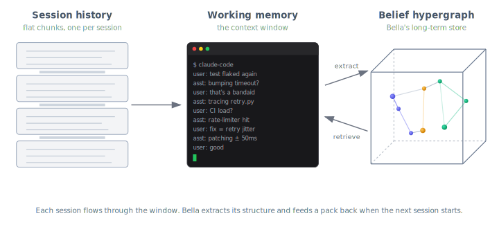
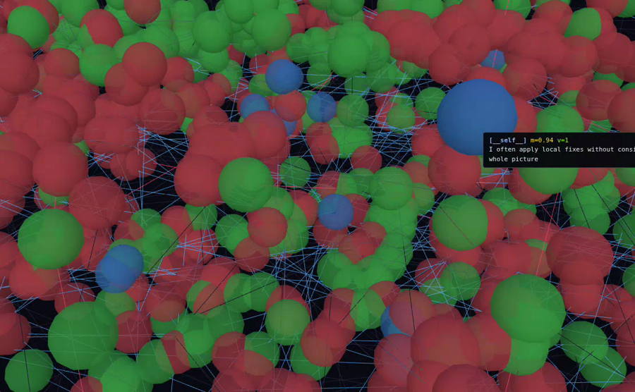

<p align="center">
  
</p>

**RAG retrieves documents. Agents need to retrieve beliefs.**

> Bella is the visual brand; the Python package and CLI remain
> `bellamem`. `pipx install bellamem`, then `bellamem save`.

---

## The problem

Your AI agent is like a brilliant intern with amnesia. Every morning
you re-explain the project. Every afternoon it re-introduces the bug
you fixed yesterday. It smiles and nods and produces confidently wrong
output. Fluent, agreeable, and fundamentally untrustworthy.

**Loses continuity.** Today's session suggests the exact bandaid you
rejected yesterday. Yesterday doesn't exist.

**Hits the wall.** `/compact` and `/clear` evaporate the specifics —
rejected approaches, causal chains, small invariants that took ten
messages to earn.

**Confabulates with conviction.** When it forgets, it doesn't ask to
be reminded. It re-asserts the wrong approach with full confidence,
and *you're* the one who has to catch it every time.

One root cause: **agents only have working memory.** The context
window *is* the memory. When a turn falls out, it's gone — and the
agent carries on unaware, filling the gap with plausible defaults.
You can't guardrail a system that doesn't own its own beliefs.

**Bella is the long-term memory layer.** It extracts the *structure*
of every conversation — decisions, rejected approaches, causes,
self-observations — into a belief hypergraph that survives `/clear`,
new sessions, and new days. When tomorrow's session asks about the
flaky test, it loads what yesterday decided, what yesterday rejected,
and why.

---

## Before and after

A real debugging session — twenty turns of dead-ends, side-questions,
acknowledgments, and the actual fix at the end. Left column is what
the context window holds. Right column is what Bella extracts
alongside it — and what survives after `/clear`.

<table>
<tr>
<th width="50%">Flat session &mdash; what the context window holds</th>
<th width="50%">Bella hypergraph &mdash; what survives</th>
</tr>
<tr>
<td valign="top">

```text
user:      test flaked again, 3rd time
assistant: which one — auth or sync?
user:      sync_external_api, like last time
assistant: ok, looking at retry.py
assistant: timeout hardcoded to 2s. bump to 5s?
user:      bandaid, don't paper over it
user:      we need to know WHY it times out
assistant: fair. tracing retry logic
assistant: sync retries with 200ms backoff
assistant: huh, only one retry — that's tight
user:      CI load? Mondays spike hard
assistant: checking metrics dashboard...
assistant: yes — CI hits the rate-limiter
assistant: first retry hits same limit, fails
assistant: 2s window exceeded before retry
user:      real fix: retry jitter, not timeout
assistant: agreed. patching: backoff ± jitter
user:      good
assistant: add latency metrics too?
user:      not now, focus on the fix
```

</td>
<td valign="top">

```text
[retry-jitter is the fix]
   m=0.74  v=2  (user + assistant)

  ⇒ cause chain
     CI load → rate-limiter → first retry
     → 2s window exceeded before retry

  ⊥ rejected
     "bump timeout from 2s to 5s"
     (user: "bandaid, not a fix")

  __self__  observation
     "I reach for timeout bumps when retry
      semantics are the real problem"
```

</td>
</tr>
<tr>
<td>

*~220 tokens · 20 turns · ordered by time · dies at `/clear`*

</td>
<td>

*~50 tokens · 4 beliefs · ordered by evidence mass · persists*

</td>
</tr>
</table>

Same information content, different geometry. The left column lets an
agent reconstruct *what was said*. The right column lets it
reconstruct *what was decided, what was rejected, and what caused
what* — in far fewer tokens, and across the session boundaries where
the left column can't go.

<p align="center">
  
</p>

And the four items on the right are exactly the ones the agent would
otherwise forget, re-suggest, or confabulate about tomorrow: a
ratified decision (mass earned from two voices), a causal chain (the
*why*), a dispute (the rejected bandaid, which Bella's edit guard
will block if the agent tries it again), and a self-observation about
its own reasoning pattern.

---

## Install

`pipx` is the recommended path — a single global `bellamem` command,
no `.venv` to remember, no PATH surgery:

```bash
pipx install bellamem
# or, from a local clone:
git clone https://github.com/immartian/bellamem
pipx install -e ./bellamem                  # editable install, still global
```

Per-project venv also works:

```bash
cd your-project
python3 -m venv .venv
.venv/bin/pip install bellamem
```

Optional extras:

```bash
pipx inject bellamem 'sentence-transformers>=2.2'   # local embeddings
pipx inject bellamem 'openai>=1.0'                  # OpenAI embeddings + LLM EW
# or with pip:
pip install 'bellamem[st]'      # sentence-transformers
pip install 'bellamem[openai]'  # OpenAI
pip install 'bellamem[all]'     # both
```

Copy `.env.example` → `.env` in your project and fill in the backends
you enabled. `.env` is gitignored.

**Requirements:** Python 3.10+. Git (Bella scopes per-project state via
the git repo root). No other system dependencies.

---

## Quickstart

Three retrieval modes — one for each question you actually ask
about your memory. Most workflows live in these three commands:

| Command | Question |
|---|---|
| `bellamem expand "X"` | *What do we **believe** about X, ranked by importance?* |
| `bellamem surprises` | *What just **changed** — what mattered?* |
| `bellamem replay [X]` | *What did we **say** — in what order?* |

Plus utility commands for ingest, audit, render, prune, and bench:

```bash
# Ingest Claude Code sessions for the current project.
# Auto-runs R3 consolidation (merges near-duplicates) on new claims.
bellamem save

# Three retrieval modes — same memory, different questions:
bellamem expand "what did we decide about persistence"
bellamem surprises                                      # top jumps, sign flips, disputes
bellamem replay                                         # narrative timeline
bellamem replay "ad-hoc bandaid pattern"                # focused narrative

# The pre-edit pack: no recency, surfaces invariants + disputes + causes
bellamem before-edit "should I wrap this in try/except" --entity embed.py

# Health report: bandaid piles, duplicates, garbage field names, mass limbo
bellamem audit

# Render the graph as a picture (needs the [viz] extra or graphviz CLI)
bellamem render --out graph.svg                           # whole forest
bellamem render --out disputes.svg --disputes-only        # just ⊥ edges
bellamem render --out auth.svg --focus "auth tokens"      # subgraph around a focus

# Forget orphan leaves that never earned their place (dry run by default)
bellamem prune                        # preview candidates
bellamem prune --apply                # actually remove them

# Empirically compare context strategies (flat, compact, RAG, Bella)
bellamem bench
```

Every command except `save`, `emerge`, `prune --apply`, and `scrub` is
read-only.

---

## Use with Claude Code

The flow that lets you keep working past the context window without
losing the thread is packaged into four slash commands.

### Install the slash command — once, globally

```bash
bellamem install-commands           # writes ~/.claude/commands/bellamem.md
```

`/bellamem` now works in **every** Claude Code project on your
machine. Per-project install (`--project`) is also supported if you
want to commit the slash command into a specific repo.

### The commands

| Command | What it does |
|---|---|
| `/bellamem` or `/bellamem resume` | Working-memory replay tail + long-term expand pack + top surprises. Run at session start. |
| `/bellamem save` | Ingest the current session (auto-consolidates), run audit, report top new surprises. Run before `/clear` or at end of day. |
| `/bellamem recall <topic>` | Mass-ranked beliefs about a topic, disputes included. Mid-session lookup. |
| `/bellamem why <topic>` | Pre-edit pack: invariants, disputes, causes, entity bridges. Run before a risky change. |
| `/bellamem replay` / `/bellamem audit` | Raw CLI output when you want to look at it directly. |

### The save → clear → resume flow

```
/bellamem save     ← captures this session into the graph
/clear             ← wipe the context window (Claude Code built-in)
/bellamem resume   ← fresh assistant reconstructs where you were
```

On a well-tuned project, `/bellamem resume` comes back in **~30k
tokens** and contains enough to pick up the next decision without
re-asking questions already answered. If it's much larger, run
`bellamem emerge` to consolidate near-duplicates.

### The edit guard (v0.0.4)

Install `bellamem-guard` as a Claude Code **PreToolUse hook** and an
advisory pack (invariants + disputes + causes for the focus) is
injected automatically before every `Edit` / `Write` / `MultiEdit`
call — no manual invocation needed. The guard `exit-2`s when the edit
re-suggests a rejected approach (a `⊥` dispute), refusing the tool
call at the boundary.

Hook registration (once per project) in `.claude/settings.json`:

```json
{
  "hooks": {
    "PreToolUse": [
      { "matcher": "Edit|Write|MultiEdit", "hooks": [{ "type": "command", "command": "bellamem-guard" }] }
    ]
  }
}
```

### Where your data lives

```
~/.claude/commands/
  bellamem.md            installed once (global slash command)

<your-project>/
  .claude/settings.json  PreToolUse hook registration (optional)
  .graph/
    default.json          belief graph (gitignored by default)
    default.emb.bin       belief embeddings, v3 binary sidecar
    embed_cache.json      embedding cache (pruned to live beliefs on save)
    llm_ew_cache.json     LLM EW cache (if BELLAMEM_EW=hybrid)
  .env                    your API keys + embedder choice (never commit)
```

`.graph/` is gitignored by default.

---

## Bella vs `/compact`

Both compress a long session. The difference is load-bearing:

| | `/compact` | Bella |
|---|---|---|
| **Output** | One narrative summary (~2000 tokens) | Queryable belief graph (~3k per retrieval) |
| **Shape** | Prose | Beliefs + typed edges (`→`, `⊥`, `⇒`) + mass + voices + sources |
| **Usage** | Replaces history; summary becomes new context | Load on demand per turn; three retrieval modes |
| **Preserves** | Broad topics, major decisions, flow | Paraphrased decisions, rejected approaches, cause-effect chains, self-observations, line numbers |
| **Loses** | Identifiers, ⊥ corrections, causal structure | Tool outputs, file contents, conversational texture |
| **Cross-session** | None — dies with the session | Full — graph persists, next session inherits it |

On our 13-item bench, compact scored **8%** LLM-judge; Bella's
`expand` scored **92%**. Narrative summaries preserve themes;
structured retrieval preserves decisions. The two are complementary:
`/compact` keeps the *feel* inside one session; Bella keeps the
*decisions* across sessions.

---

## See the graph

A preview of the v0.1.1 3D viz rendering a real Bella belief
hypergraph — roughly 1,800 beliefs from a month of Claude Code
sessions on Bella itself, across eight topical fields. Drag to
rotate; the replay bar scrubs history so you can watch the graph
accumulate decision by decision.

<a href="https://github.com/immartian/bellamem/raw/master/docs/bella-viz3d.webm">
  
</a>

*Click the image above to play the .webm. (GitHub doesn't reliably embed `<video>` tags pointing at raw files, so the poster + link is the universal fallback.)*

---

## Empirical results

Latest measurement: [benchmarks/v0.0.4rc1.md](https://github.com/immartian/bellamem/blob/master/benchmarks/v0.0.4rc1.md)
(2026-04-10, budget = 1200 tokens, LLM judge enabled, 13-item
hand-labeled corpus, 1834-belief forest).

```
metric               flat_tail      compact     rag_topk       expand  before_edit
----------------------------------------------------------------------------------
exact hit rate            15 %          0 %         15 %         69 %         46 %
embed hit rate            23 %         31 %         31 %         85 %         77 %
llm judge rate             0 %          8 %         31 %         92 %         69 %
avg tokens used           1200          602         1161         1143          964
```

`flat_tail (0%) < compact (8%) < rag_topk (31%) < before_edit (69%) < expand (92%)`.

**Headline story — compare to [v0.0.2](https://github.com/immartian/bellamem/blob/master/benchmarks/v0.0.2.md):** as
the forest grew from the v0.0.2 dogfood snapshot to 1834 beliefs,
`rag_topk` collapsed from 85% → 31% LLM judge (cosine top-k pulls up
more plausible-looking-but-wrong neighbors in a larger forest), while
`expand` held at 92%. The gap from `expand` to the next-best contender
widened from **15pp to 61pp**. Structured mass-weighted retrieval
scales with forest size; cosine top-k doesn't. The retrieval code
path (`core/expand.py`, `core/bella.py`) is unchanged between v0.0.2
and v0.0.4rc1 — every delta is a property of forest growth, not
algorithm changes.

See [benchmarks/README.md](https://github.com/immartian/bellamem/blob/master/benchmarks/README.md) for the versioning
convention and when to re-run.

---

## Limitations

Bella lives alongside the agent, not inside it. That boundary is
load-bearing and currently unmoved: we can't reach in and rewrite the
context window directly. What we have today is advisory:

- **No direct context-window control.** Bella can't swap active
  tokens, evict irrelevant context, or replace the window wholesale.
  The agent still controls what it attends to; Bella can only offer
  packs the agent can choose to read.
- **/compact stays LLM-driven.** Claude Code's native `/compact`
  writes a narrative summary via an LLM call. A `PreCompact` hook
  that lets Bella substitute a graph-backed compaction would unlock
  most of the remaining wins — and that hook surface does not exist
  in Claude Code today. We can't intercept it from outside.
- **Save/clear/resume is a manual pattern.** You run `/bellamem save`
  → `/clear` → `/bellamem resume` yourself. It works, but it's a
  human-in-the-loop ritual, not an autonomous context manager.
- **The edit guard is a tool-call boundary, not a semantic gate.**
  `bellamem-guard` injects an advisory pack before every edit and
  `exit-2`s on a dispute re-suggestion, but it sees tool-call text,
  not model intent. An agent that ignores the advice can still try
  the edit; the block is at the boundary, not deeper in the model.
- **One adapter at a time.** Claude Code works today. Codex and
  others need their own turn-pair reaction classifier and source
  stamper.

The common thread: every limitation above is about how much of the
agent's context lifecycle we can observe and influence from outside.
With deeper hooks — or a coding agent that exposed its context as a
first-class API — a graph memory like Bella could drive the compaction
cycle itself instead of being handed the leftovers. **We expect the
upside of real context-window control to be substantial.** For now,
the honest frame is: Bella is the memory layer; the agent is still
the window manager.

---

## Status

**v0.1.0 — alpha, dogfooded on its own construction.** Bella was
built in Claude Code sessions that were themselves ingested into the
Bella being built. When the assistant drifted into an ad-hoc bandaid
pattern during development, the user's correction landed in the graph
as the highest-surprise belief of the session. That kind of
self-observation is the point.

Since v0.0.2:

- **v0.0.3** — per-project `.graph/`, automatic R3 consolidation on
  ingest, source grounding + narrative replay, structural pruning,
  `bellamem save` default-to-current-session with incremental ingest,
  and embed-cache prune bounded to live beliefs.
- **v0.0.4rc1** — storage split: belief embeddings moved out of
  `default.json` into a `default.emb.bin` sidecar (v3 format),
  cutting non-vector operations' load time from ~2s to ~500ms.
  `bellamem-guard` PreToolUse hook ships: advisory pack before
  every edit, exit-2 block on dispute re-suggestions. Embedder
  batching reduces save latency.
- **v0.1.0** — log-odds decay gated on `BELLAMEM_DECAY=on`: on every
  save, non-exempt beliefs fade exponentially toward the 0.5 prior at
  a 30-day half-life (reserved fields, `mass_floor` pins, ⊥ disputes,
  and ⇒ causes are exempt). New `bellamem decay` subcommand for
  dry-run preview + `--apply`. v3 → v4 snapshot format adds a
  `decayed_at` header. See the "Decay and reinforcement — the steady
  state" section of THEORY.md for the collision math.
- **v0.1.1 (planned)** — decay on by default after dogfood validates
  the steady state, Three.js 3D viz with temporal replay, and
  graph-backed compaction when the hook surface allows.

See [CHANGELOG.md](https://github.com/immartian/bellamem/blob/master/CHANGELOG.md) for details.

---

## Architecture

`bellamem.core` (Jaynes accumulation, expand, audit, prune, replay)
never imports from `bellamem.adapters` (Claude Code reader, LLM EW,
turn-pair classifier). Core is domain-agnostic; adapters are where
domain knowledge lives. Seven mutation operations, pluggable
embedders, split snapshot storage.

Full file tree and invariants: **[ARCHITECTURE.md](https://github.com/immartian/bellamem/blob/master/ARCHITECTURE.md)**.

---

## Theory

The formal calculus — six rules, invariants, Bayesian grounding,
domain-agnostic case studies — lives in **[`bella/`](bella/)**:

- **[SPEC.md](bella/SPEC.md)** — the six rules, formal definitions
- **[VISION.md](bella/VISION.md)** — theoretical grounding (Jaynes, Gödel, self-reference)
- **[EXAMPLES.md](bella/EXAMPLES.md)** — case studies (H. pylori, continental drift, …)
- **[MEMORY.md](bella/MEMORY.md)** — how BELLA maps to LLM agent memory

**[THEORY.md](THEORY.md)** covers the implementation side: how
bellamem maps the BELLA spec to Python — thresholds, data structures,
a worked flaky-test example with before/after diagrams, and the
decay equilibrium math.

---

## Contributing

See [CONTRIBUTING.md](https://github.com/immartian/bellamem/blob/master/CONTRIBUTING.md). Short version:

- The bench is the CI. Run `bellamem bench` after changes to EW,
  expand, or audit and report the delta in the PR.
- Add new embedders by implementing the `Embedder` protocol in
  `core/embed.py`.
- Add new EW logic in `adapters/`, never in `core/`.
- Every PR that touches retrieval should include a bench item
  demonstrating the failure mode it fixes.
- Dogfood changes against Bella's own snapshot before shipping.
  Unit tests prove code runs; running Bella against its own graph
  proves the feature is useful.

---

## License

AGPL-3.0-or-later. See [LICENSE](https://github.com/immartian/bellamem/blob/master/LICENSE).
