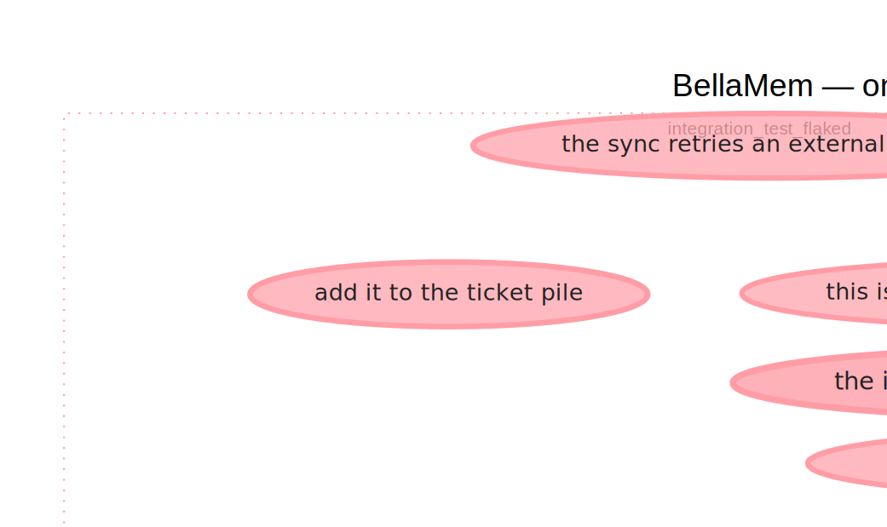
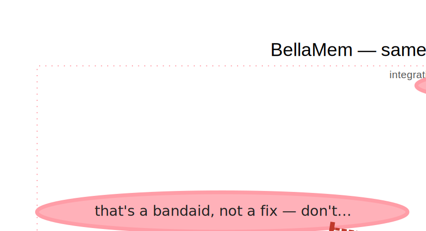
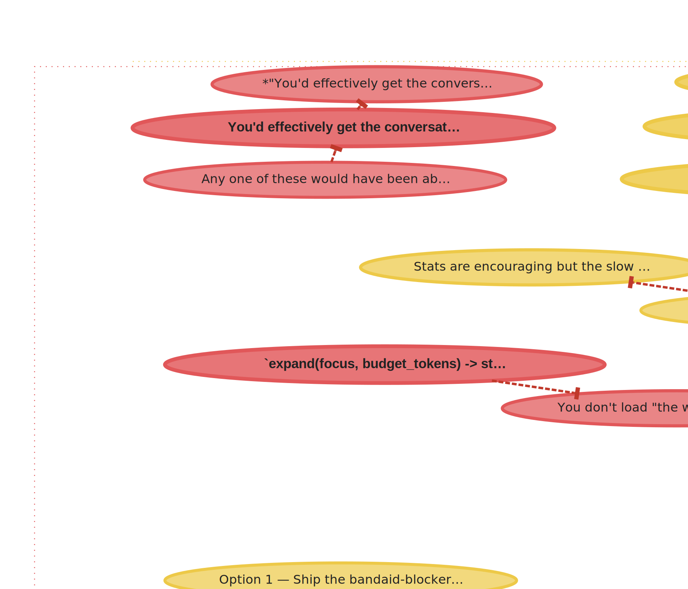

# BellaMem

**Graph memory for agentic coding.**

---

## What changes

A normal Claude Code session is a flat sequence of turns. The context
window holds them in order; when it fills up, the oldest are summarized
or dropped. BellaMem runs alongside and extracts the *structure* the
turns contain — decisions, rejected approaches, cause chains,
self-observations — into a belief graph that survives session
boundaries. The same eight turns of a debugging session carry different
information depending on which shape you keep:

```
Flat recency (what the context window holds)    │  BellaMem graph (what survives)
─────────────────────────────────────────────────┼──────────────────────────────────────
user:      test flaked again, third time        │  ratified: retry-jitter fix
assistant: I'll bump the timeout to 5s           │    m=0.74  v=2  (user + assistant)
user:      don't paper over it                   │
assistant: sync retries at 200ms backoff         │     ⇒  CI load → rate-limit → 2s exceeded
assistant: CI load spikes, rate-limiting         │
user:      so the fix is retry jitter            │     ⊥  "bump timeout to 5s"  (rejected)
assistant: patched retry.py, backoff + jitter    │
user:      good                                  │   __self__: "I reach for bandaids when
─────────────────────────────────────────────────┤              retry semantics are the real
8 turns, ~110 tokens, ordered by time            │              problem"
                                                 │  ──────────────────────────────────────
                                                 │  4 beliefs + 2 edge types, ~30 tokens,
                                                 │  ordered by evidence and structure
```

Same information content, different geometry. The left column lets an
agent reconstruct *what was said*. The right column lets it reconstruct
*what was decided, what was rejected, and what caused what* — in a tenth
the tokens, and across session boundaries where the left column can't go.

The rest of this document is a worked example that produces that graph
from an actual dialogue, a short theory section on why it works, and
instructions for using BellaMem with Claude Code.

---

## How do we think?

We remember something from long before — a rule we learned years ago, a
correction from last quarter, a bug we fixed in a codebase we haven't
touched in months — and yet in the very same moment we hold the exact
sentence we just heard, the line of code we're about to edit, the
question still hanging in the air. Kahneman called it fast and slow.
The quieter way to say it: we have working memory and long-term memory,
and the remarkable thing isn't that we have both — it's that we compose
them seamlessly. The invariant you learned a decade ago and the word
someone said two seconds ago both land in your attention together,
weighted by relevance to what you're doing right now. No special layer
for "recent," no separate storage for "important." One mind, two
consolidation states, one composed answer.

LLM coding agents don't think this way. They have one layer: the context
window. Everything in it is "now"; everything outside it is gone. When
the window fills, `/compact` summarizes the tail and the specifics
disappear. When a session ends, the decisions evaporate. The next
session asks the same questions that were answered yesterday, makes the
same mistakes that were corrected last week, re-suggests approaches the
user already rejected — because nothing persisted between the flat tail
and the empty start. The agent has a kind of working memory. It has no
long-term memory at all.

**BellaMem is an attempt to give agents the missing layer — and the
bridge between the two.**

It's a local, file-backed belief graph that accumulates what matters
across sessions and topics: the decisions you ratified, the approaches
you rejected, the causal chains you traced, the patterns you've observed
in your own behavior. Each belief carries a *mass* — confidence
accumulated via Jaynes' log-odds from every time the belief was re-said,
re-confirmed, or contradicted — and typed edges: `→` support,
`⊥` counter-evidence, `⇒` cause. Beliefs also carry their provenance:
the session file and line number of every turn that contributed to
them, so you can always trace a claim back to what was actually said.

When an agent is about to act, it doesn't reload the whole tree. It
calls `expand(focus, budget)` and gets back a tight context pack —
mass-weighted, dispute-aware, with a continuous freshness bonus so
recent turns surface naturally without a dedicated "recent layer." The
same retrieval function answers both *"what did we decide about auth?"*
(mass dominates) and *"what am I in the middle of?"* (freshness
dominates). The graph doesn't fight the context window; it compresses
into it, on demand, at query time.

The consolidation story matters as much as the retrieval story. New
beliefs enter raw, young, and source-grounded. An automatic
consolidation pass runs after each ingest: near-duplicates collapse,
fields rename themselves from their own content, the graph's shape
quietly improves. The distinction between working memory and long-term
memory isn't a layer — it's an emergent property of where a belief sits
in the consolidation pipeline. Recent beliefs are raw because they
haven't been processed yet; old beliefs are compressed because they
have. Same model, different states.

Thinking fast and slow isn't a trick. It's composition. An agent with
working memory and no long-term memory is half-blind. An agent with
long-term memory and no fidelity on recent turns is half-deaf. BellaMem
is trying to give agents both — and to make the boundary between them
soft enough that neither the agent nor the user has to reason about
which layer a given fact came from. You just ask, and the right thing
comes back.

---

## Three ways to ask the same memory

BellaMem exposes the graph through three retrieval commands that answer
different questions about the same store:

| Command | Question | Example |
|---|---|---|
| [`bellamem expand "X"`](#expand-and-before-edit) | *What do we **believe** about X, ranked by importance?* | `bellamem expand "how should auth tokens be stored"` |
| [`bellamem surprises`](#surprises) | *What just **changed** — what mattered?* | surfaces user corrections, sign flips, new disputes |
| [`bellamem replay [X]`](#replay) | *What did we **say** — in what order?* | narrative timeline reconstructed from source line numbers |

Together they form a belief-and-narrative view of the session: facts
(expand), signal (surprises), story (replay).

---

## A worked example: one session, compressed

Here is the full flaky-test debugging session that the hook at the top
of this document teases. Every number and every rendered diagram below
is produced by running [`docs/example_session.py`](docs/example_session.py)
against the real BellaMem core — no synthetic diagrams, no hand-waved
numbers. A pytest smoke test keeps the example from drifting when the
code changes.

### The session

```text
user:      the integration test flaked again, third time this week
assistant: I'll bump the sync timeout from 2s to 5s
user:      that's a bandaid, not a fix — don't paper over it
assistant: the sync retries an external api with 200ms backoff
assistant: CI load spikes rate-limit us and the first retry also fails
assistant: we exceed the 2s window before the second retry completes
user:      so the real fix is retry jitter, not timeout bumping
assistant: so the real fix is retry jitter, not timeout bumping
assistant: I reach for timeout bumps when retry semantics are the real problem
assistant: patched retry.py — exponential backoff, jitter ±50ms
user:      good
assistant: this is the third rate-limit incident on this path this quarter
user:      add it to the ticket pile
```

Thirteen turns. A correction. A cause chain. A ratified fix. A
self-observation. And a few observations nobody followed up on —
things that were said once and never referenced again.

### The graph right after ingest



Eleven beliefs, two fields. Every structural primitive BellaMem
cares about is present: a ⊥ dispute (the user denying the timeout
bump), a ⇒ cause chain running from "CI load" through "rate-limit"
to "2s window exceeded", a two-voice ratified decision ("retry jitter
is the fix"), a `__self__` observation ("I reach for timeout bumps
when retry semantics are the real problem"), and four single-voice
leaves that landed in the graph and then the conversation moved on.

### The same graph thirty days later

```bash
bellamem emerge         # R3 consolidation — no-op here, nothing to merge
bellamem prune --apply  # structural forgetting — removes unratified leaves
```



Seven beliefs. The four single-voice leaves that never earned
structural ties are gone. Everything that *did* earn structural
ties — the dispute, both cause edges, the ratified decision, the
self-observation, and the load-bearing ancestors of every kept
edge — survived untouched. Nothing with children, multi-voice
evidence, or a structural role was even considered for removal.

### The numbers

| | before | after |
|---|---:|---:|
| total beliefs | 11 | 7 |
| single-voice leaves | 7 | 3 |
| ratified decisions (multi-voice) | 1 | 1 |
| ⊥ disputes | 1 | 1 |
| ⇒ cause edges | 2 | 2 |
| `__self__` observations | 1 | 1 |
| mass in limbo band (0.48–0.55) | 7 | 3 |
| Shannon entropy of mass distribution | 3.45 bits | 2.79 bits |

A 36% reduction in belief count, a 19% reduction in mass-distribution
entropy, and every load-bearing piece of memory preserved exactly.
The "compression" is literal: fewer symbols, same decisions, same
disputes, same causal story — measured in bits.

---

## Why it works: Jaynes × Shannon × Recursive Emergence

Three ideas do the heavy lifting. None of them are BellaMem's — the
work is assembling them into a concrete, queryable substrate for one
specific kind of memory.

**Jaynes.** A belief's mass is not a truth value; it's a sigmoid over
accumulated log-odds. Every piece of evidence adds `log(lr)` to the
accumulator, and the sigmoid keeps the result in `[0, 1]`. This is
E.T. Jaynes's Bayesian update rule, which is the only coherent way to
combine independent evidence without throwing information away. The
voice-attenuation factor (same-voice evidence is attenuated 10×)
enforces the "independent" part: an assistant repeating itself cannot
fake ratification, because its log-odds contribution decays. That's
what makes the `expand` pack rank-orderable by mass in a principled
way instead of by arbitrary weights.

**Shannon.** Entropy is literal, not metaphorical. The "mass limbo
band" is a high-entropy region *by definition*: a belief at mass 0.52
carries ≈1 bit of pure uncertainty because it has no evidence to
distinguish true from false. When `prune` removes the four residue
leaves in the example, it isn't cleanup — it's a measurable drop in
the Shannon entropy of the mass distribution (3.45 → 2.79 bits). The
audit's other entropy signals (bandaid piles, root glut, garbage
field names) are structural entropy measures too, in the same sense:
each one quantifies specific forms of disorder the graph has failed
to resolve.

**Recursive Emergence.** The [RE thesis](https://github.com/Recursive-Emergence/RE/blob/main/thesis.md)
proposes a unified principle: "every meaningful structure arises from
interactions that reduce entropy while generating reusable patterns,"
and those patterns accumulate into memory that biases future
interactions toward more structure. The thesis's three symbols map
onto BellaMem directly — **Ψ** (recursive memory state) is the belief
graph, **Φ** (emergent coherence) is a ratified belief, **Ω**
(contradiction-resolving lattice) is the ⊥ dispute structure. The
memory update law `Ψ(t+1) = Ψ(t) + ∫ w(φ)·φ dφ` is the integral form
of Jaynes's log-odds accumulation. The emergence potential
`P = R · ΔH · S` (reusability × entropy reduction × structural
compatibility) is what `expand(focus, budget)` computes when it ranks
beliefs for retrieval. BellaMem isn't *inspired by* RE — it's a
minimal working instance of RE for conversational coding memory.

Nothing above is original. The work is the assembly: making these
three ideas commit to specific decisions about what to store, what
to merge, what to forget, and what to retrieve, so that an agent's
next edit can actually use them.

---

## Install

Pick whichever matches how you like to install Python tools. The
recommended path is **pipx** — a single global `bellamem` command, no
`.venv` to remember, no PATH surgery:

```bash
pipx install bellamem                      # once published to PyPI
# or, from a local clone:
git clone https://github.com/immartian/bellamem
pipx install -e ./bellamem                  # editable install, still global
```

Prefer a per-project venv? That works too:

```bash
cd your-project
python3 -m venv .venv
.venv/bin/pip install bellamem              # or: pip install -e /path/to/bellamem
```

Optional extras (add to whichever install style you picked):

```bash
pipx inject bellamem 'sentence-transformers>=2.2'   # local embeddings
pipx inject bellamem 'openai>=1.0'                  # OpenAI embeddings + LLM EW
# or with pip:
pip install 'bellamem[st]'    # sentence-transformers
pip install 'bellamem[openai]' # OpenAI
pip install 'bellamem[all]'    # both
```

Copy `.env.example` → `.env` in the project you want bellamem to
operate on, and fill in the backends you enabled. `.env` is
gitignored.

**Requirements:** Python 3.10+. Git (bellamem uses the git repo root to
scope per-project state). No other system dependencies.

---

## Quickstart

```bash
# Ingest Claude Code sessions for the current project.
# Auto-runs R3 consolidation (merges near-duplicates) on new claims.
bellamem ingest-cc

# Three retrieval modes — same memory, different questions:
bellamem expand "what did we decide about persistence"
bellamem surprises                                      # top jumps, sign flips, disputes
bellamem replay                                         # narrative timeline of the latest session
bellamem replay "ad-hoc bandaid pattern"                # focused narrative

# The pre-edit pack: no recency, surfaces invariants + disputes + causes
bellamem before-edit "should I wrap this in try/except" --entity embed.py

# Health report: bandaid piles, duplicates, garbage field names, mass limbo
bellamem audit

# Render the graph as a picture (needs the [viz] extra or graphviz CLI)
bellamem render --out graph.svg                           # whole forest
bellamem render --out disputes.svg --disputes-only        # just ⊥ edges
bellamem render --out auth.svg --focus "auth tokens"      # subgraph around a focus

# Forget orphan leaves that never earned their place (dry run by default)
bellamem prune                        # preview candidates
bellamem prune --apply                # actually remove them

# One-time migrations
bellamem scrub                     # remove system-noise beliefs from old snapshots
bellamem emerge --llm              # merge near-duplicates + rename fields via cheap LLM

# Empirically compare context strategies (flat, compact, RAG, BellaMem)
bellamem bench
```

Every command except `ingest-cc`, `emerge`, and `scrub` is read-only.

### Starting a new session from an existing tree

The belief tree lives at `<project>/.graph/default.json` by default
(override with `BELLAMEM_SNAPSHOT`). It survives Claude Code session
boundaries, `/compact`, and process restarts. Each project gets its own
graph — no cross-project leakage.

> Upgrading from pre-v0.0.3? Your old graph is at `~/.bellamem/default.json`.
> Run `bellamem migrate` once in your project to copy it into `.graph/`.
> The legacy file is left in place; delete it manually after you've
> verified everything works.

To pick up where a prior session left off:

```bash
# 1. At the end of the current session, update the tree
bellamem ingest-cc    # auto-consolidates via R3

# 2. Start the new Claude Code session (in a new context window)

# 3. At the start of the new session, load the session tail verbatim
#    (this is the working-memory hand-off):
bellamem replay -t 2000

# 4. For a specific piece of work, pre-load the structured context:
bellamem before-edit "the thing I'm about to work on" --entity <file>

# 5. If something feels surprising, ask for context:
bellamem expand "what did we decide about <topic>"
```

**BellaMem restores knowledge, not environment.** For a complete
memory at the start of a new session, combine it with `git` (code
state) and Claude Code's native tools (filesystem, environment). Any
one of them alone is incomplete.

---

## Use with Claude Code

The hand-off flow above is easier to run through a set of **slash
commands** that ship with BellaMem. They package the `/save` → `/clear`
→ `/resume` pattern into four friendly entry points so you never have
to remember a CLI invocation mid-session.

### Install the slash command — once, globally

```bash
bellamem install-commands           # writes ~/.claude/commands/bellamem.md
```

That's it. `/bellamem` now works in **every** Claude Code project on
your machine, because `~/.claude/commands/` is user-level (as opposed
to project-level at `.claude/commands/`). The installed command is a
single self-contained markdown file that calls the `bellamem` CLI —
no shell dispatcher, no per-project copies to maintain.

Want it per-project instead (e.g. to commit the slash command into a
repo)?

```bash
bellamem install-commands --project     # writes ./.claude/commands/bellamem.md
bellamem install-commands --dry-run     # show the target path without writing
bellamem install-commands --force       # overwrite an existing file
```

The command assumes `bellamem` is on your `$PATH`. The recommended
path is `pipx install bellamem` (see [Install](#install)), but any
method that puts `bellamem` on `$PATH` works — project-local venvs,
system packages, user installs.

### The four commands

| Command | What it does |
|---|---|
| `/bellamem` or `/bellamem resume` | Working-memory replay tail + long-term-memory expand pack + top surprises. Run at session start. |
| `/bellamem save` | Ingest the current session (auto-consolidates), run audit, report top new surprises. Run before `/clear` or at end of day. |
| `/bellamem recall <topic>` | Mass-ranked beliefs about a topic, disputes included. Mid-session lookup. |
| `/bellamem why <topic>` | Pre-edit pack: invariants, disputes, causes, entity bridges. Run before a risky change. |
| `/bellamem replay` / `/bellamem audit` | Raw CLI output for when you want to look at it directly. |

### First run

In a fresh Claude Code session inside any project:

```
/bellamem help
```

You should see the usage message. If you get `command not found:
bellamem`, the slash command was installed correctly but the `bellamem`
CLI itself isn't on your `$PATH`. Fix with `pipx install bellamem` or
activate the venv that has it installed.

### The save → clear → resume flow

The flow that lets you keep working past the context window without
losing the thread:

```
/bellamem save     ← captures this session into the graph
/clear             ← wipe the context window (Claude Code built-in)
/bellamem resume   ← fresh me reconstructs where we were
```

On a well-tuned project, `/bellamem resume` comes back in ~30k tokens
and contains enough to pick up the next decision without re-asking
questions that were already answered. That's the working reference
point — a resume that costs much more is usually a sign the graph
needs `bellamem emerge` to consolidate near-duplicates.

> **First run on an existing project may take a while.** BellaMem
> ingests every Claude Code transcript the project has accumulated,
> not just the current session. A project with months of history and
> hundreds of megabytes of transcripts can take tens of minutes to
> several hours on the *first* `/bellamem save`. Two ways to bound it:
>
> ```bash
> bellamem save --tail 200       # only the last 200 turns of each transcript
> bellamem save --latest-only    # only the single most recent transcript
> ```
>
> Subsequent saves are incremental — only new turns get processed —
> so the first run is usually the only slow one.

### Where your data lives

```
~/.claude/commands/
  bellamem.md            installed once (global slash command)

<your-project>/
  .graph/
    default.json          belief graph (gitignored by default)
    embed_cache.json      embedding cache (if BELLAMEM_EMBEDDER ≠ hash)
    llm_ew_cache.json     LLM EW cache (if BELLAMEM_EW=hybrid)
  .env                    your API keys + embedder choice (never commit)
```

`.graph/` is gitignored by default. Remove the entry from `.gitignore`
if you *want* to commit your graph (small teams sharing a single
memory, or archival).

### Environment notes

- **Python 3.10+.** The CLI is stdlib-only by default.
- **No API key required** for the default hash embedder and regex EW.
- **`OPENAI_API_KEY`** only matters if you set `BELLAMEM_EMBEDDER=openai`
  or `BELLAMEM_EW=hybrid` in `.env`. Cost is ~$0.002 per typical 98-turn
  session in hybrid mode.
- **`BELLAMEM_SNAPSHOT`**, **`BELLAMEM_EMBEDDER_CACHE_PATH`**, and
  **`BELLAMEM_EW_LLM_CACHE_PATH`** override the project-local defaults
  if you need to point somewhere else.

---

## BellaMem vs `/compact`

Both compress a long session into something smaller. They do it
differently and the difference is load-bearing:

| | `/compact` | BellaMem |
|---|---|---|
| **Output** | One narrative summary (~2000 tokens) | Queryable belief graph (~3k per retrieval) |
| **Shape** | Prose | Beliefs + typed edges (`→`, `⊥`, `⇒`) + mass + voices + sources |
| **Usage** | Replaces history; whole summary becomes new context | Load on demand per turn; three retrieval modes |
| **Preserves** | Broad topics, major decisions, conversational flow | Paraphrased decisions, rejected approaches, cause-effect chains, self-observations, source line numbers |
| **Loses** | Specific identifiers, ⊥ corrections, cause-effect structure | Tool outputs, file contents, conversational texture |
| **Cross-session** | None — compacted context dies with the session | Full — the graph persists and next session inherits it |
| **Narrative replay** | Via the summary's prose order | Via `bellamem replay` — actual chronological line-by-line |

On our bench, the compact-style contender (gpt-4o-mini summary) scored
**8% LLM-judge rate**; BellaMem's `expand` scored **92%** at a comparable
budget. The structural weakness of narrative summaries is that they
preserve themes but lose the specific decisions, corrections, and causes
an agent actually needs to act. See [BENCH.md](BENCH.md) for the full
numbers.

The two are complementary, not competing: `/compact` keeps the *feel*
of the conversation going inside one session. BellaMem keeps the
*decisions* available across sessions, and `bellamem replay` gives you
a structured narrative view when you want one.

### What the graph actually looks like

This is BellaMem's own belief graph, filtered to just the **⊥
dispute edges** — the rejected approaches the project has considered
and moved past. Each red dashed edge is a branch we explicitly didn't
take. Rendered directly from the live `.graph/default.json` with
`bellamem render --disputes-only`:



This is the information `/compact` cannot preserve in narrative form.
A prose summary remembers that "the team considered X"; the graph
remembers *which* X, *why* it was rejected, *what* it was rejected in
favor of, and makes all three queryable. That's the load-bearing
difference.

---

## How BellaMem builds context

```
Raw Claude Code transcript (.jsonl)
        ↓
    system-noise filter          ── strips interrupt sentinels, command echoes
        ↓
    regex EW                      ── voice-aware (user oracle, assistant hypothesis)
        ↓
    + LLM EW                      ── CAUSE pairs, self-observations (opt-in, gpt-4o-mini)
        ↓
    Claim(text, voice, lr, relation, source=(file, line))
        ↓
    Bella.ingest()                ── routes via embedding, applies Jaynes accumulation
        ↓                            records jumps + sources on each belief
    R3 auto-emerge                ── merges near-duplicates, stabilizes structure
        ↓
    Belief graph (fields → beliefs → typed edges + sources)
        ↓
┌───────┼───────┬───────────┬───────────┬────────┐
expand() before-edit() surprises()  replay()  audit()
  mass-      5-layer      top Jaynes   line-      bandaid piles
  weighted   no recency   step surprises order    + duplicates
  with       invariants   + sign flips  timeline  + root glut
  freshness  disputes     + disputes              + limbo
             causes                                + single-voice rate
             bridges
             self-model
```

### `expand` and `before-edit`

`expand(focus, budget)` returns a mass-weighted context pack with a
continuous freshness bonus. Three layers: **60% high-mass global** (the
rules and decisions), **35% relevance** (focus cosine + freshness), **5%
disputes** touching the focus. Same retrieval function handles both
long-term recall (mass wins for focused queries) and working memory
(freshness wins for diffuse queries like *"what am I in the middle of?"*).

`expand_before_edit(focus, budget)` is the pre-edit variant. No
recency — recency biases toward the last bandaid in a critical-path
query. Five-layer split:

```
40%  invariants     — high-mass ratified beliefs anywhere in the graph
20%  disputes       — ⊥ edges touching the focus (prevents re-suggestion)
20%  causes         — ⇒ chains near the focus (root-cause awareness)
10%  entity bridges — R6 co-mention neighborhood
10%  self-model     — __self__ habit observations (R4)
```

### `surprises`

Each belief carries a bounded history of its accumulate events
(`jumps`). `surprises` walks that history and reports three signals:

- **Top Jaynes step surprises** — `|Δ log_odds|` weighted by prior
  uncertainty. A strong piece of evidence against a near-50/50 belief
  scores high; piling confirmation on a 0.95 belief scores near zero.
- **Sign flips** — jumps where the cumulative log_odds crossed zero
  (the belief passed through 0.5 and landed on the other side).
- **Recent dispute formations** — ⊥-edged beliefs ordered by recency.

This is the system's "what just mattered?" signal. On the dogfood
session where BellaMem was built, the #1 surprise was the user catching
the assistant in an ad-hoc bandaid pattern — exactly the kind of
correction the system is designed to preserve.

### `replay`

`replay()` returns beliefs from the latest session in **ascending
source-line order**, reconstructing the conversation's narrative flow
from the graph. Where `expand` answers "what do we believe?", `replay`
answers "what did we say, in what order?" Tail-preserving under tight
budgets — old entries drop first, the recent tail is always kept.

Only works on source-grounded beliefs (ingested after source tracking
shipped), which is correct: you can't fabricate provenance for beliefs
that predate the feature.

### `audit`

Read-only health report. Surfaces five entropy signals:

- **Bandaid piles** — parents with ≥3 fix-shaped children (R2 entropy)
- **Root glut** — fields where most beliefs are unconnected (no structure emerging)
- **Near-duplicate pairs** — R3 merge candidates the audit flags for emerge
- **Mass limbo** — beliefs stuck at mass 0.45–0.55 (decisions that never landed)
- **Garbage field names** — auto-generated names housing large numbers of beliefs
- Plus the multi-voice ratified decisions and top disputes summaries

An `audit` that reports "clean" is a tree that has been consolidated.

---

## Consolidation (R3 emerge)

BellaMem's core insight, beyond retrieval, is that **recency is a
consolidation state, not a storage layer**. Every belief enters the
graph raw and young. An R3 consolidation pass runs automatically at
the end of each `ingest-cc`:

- **Near-duplicate merge** — pairs of beliefs in the same field with
  embedding cosine ≥ 0.92 are folded together. Voices, log_odds,
  entities, children, and sources all move to the survivor. No mass
  is discarded.
- **Field rename** — fields whose auto-generated names look like
  regex accidents (e.g. `log_odds_accumulate_log`) get renamed from
  their own content. Two namers: a zero-dep contrastive-rate baseline,
  and (optionally) a cheap LLM refiner for cases where the corpus is
  too coherent for contrastive analysis to work.

Consolidation is idempotent — running it twice on an already-healed
tree is a no-op. `bellamem emerge --dry-run` previews what would
change without mutating the snapshot.

Over time, the distinction between working memory and long-term memory
stops being a layer and becomes an emergent property of where a belief
sits in this pipeline. Recent beliefs are raw because they haven't
been processed yet; old beliefs are compressed because they have.

---

## Forgetting (`bellamem prune`)

Accumulation without forgetting is a bug. Most of what gets said in a
long coding session is assistant-voice exposition — real sentences
about the work, but never revisited, never ratified, never disputed,
never used as the parent of another claim. They enter the graph at
base mass (0.53) and sit there forever unless something explicitly
pulls them into structure. After enough sessions, a meaningful
fraction of the graph is this kind of residue.

`bellamem prune` removes it — but only under strict structural
safety rails. A belief is a prune candidate **iff all of** the
following hold:

- It's a **leaf** (`children == []`) — nothing grew below it.
- It's single-voice — only one source has ever ratified it.
- It's in the **base-mass band** (0.48 ≤ mass ≤ 0.55) — Jaynes has
  never moved it off the prior in either direction.
- It's **not itself a ⊥ dispute or ⇒ cause** — rejected approaches
  and causal predecessors are load-bearing memory, never pruned.
- It has **no `mass_floor` pin** — pinned beliefs were deliberately
  elevated by the caller.
- It's in a **non-reserved field** — `__self__` and other system
  fields are never touched.
- It's been **untouched for at least `--age-days`** (default 30).
- It was **created more than `--grace-days`** ago (default 14) —
  brand-new beliefs always get a grace period.

By construction, anything with structural ties — children, disputes,
causes, multi-voice ratification, high mass, recent evidence — is
safe. What's left is the residue: one-off assistant observations that
nothing ever grabbed onto.

```bash
bellamem prune               # dry run, shows what would be removed
bellamem prune --apply       # actually removes them, saves the snapshot
bellamem prune --age-days 60 --max-voices 2  # looser criteria
```

Dry-run is the default. `--apply` is required to mutate. Like
`emerge` and `scrub`, `prune` is a *consolidation* operation — it
changes the graph, so it's explicit, not automatic.

Pruning is **structural**, not **Bayesian**. The principled
alternative — decaying `log_odds` toward zero over time so beliefs
regress to the prior without reinforcement — is a v0.1 design
question: it changes mass under your feet, makes `surprises` noisier,
and needs a tuned half-life constant. Structural pruning solves the
visible problem (residue accumulation) without touching the data
model. The decay version will come when the theory demands it.

`bellamem prune` complements `bellamem emerge`: **emerge merges
duplicates**, **prune removes orphans**. Together they're the full
consolidation pipeline. Beliefs enter raw, either earn their keep or
age out, and the long-term graph stays a signal, not a transcript.

---

## Provenance (source grounding)

Every belief carries a `sources: list[(session_key, line_number)]`
field. When the adapter ingests a transcript turn, the belief it
creates is stamped with the exact line the claim came from. When
retroactive ratification fires (the user saying *"yes, exactly"*
confirms the preceding assistant turn), the ratification is stamped
with the *user's* line, not the assistant's — so you can trace which
line of evidence bumped which belief's mass.

Sources enable:

- **Narrative replay** (above) — line-ordered retrieval
- **"Beliefs from the last N lines"** — direct index, no heuristic
- **Multi-source auditing** — a belief with three sources shows the
  mention → re-mention → ratification pattern as a concrete chain
- **Provenance under merge** — when two beliefs merge, their source
  lists are unioned, preserving the full evidence trail

`event_time` is still used for the freshness weight in `expand`, but
for authoritative "what was recent?" queries, sources are the truth.
Timestamps can lie (ingest time ≠ conversation time); line numbers
don't.

---

## Empirical results

From [BENCH.md](BENCH.md), measured on 15 hand-labeled queries drawn
from a real 98-turn dogfood session:

| budget | flat_tail | before_edit |
|---|---|---|
| 200 t  | —    | **80 %** |
| 500 t  | 13 % | **100 %** |
| 1000 t | 13 % | 100 % |
| 2000 t | 13 % | 100 % |
| 4000 t | 93 %*| 100 % |
| 10000 t| 93 %*| 100 % |

_\*self-referential lift — at ≥3000t the tail reaches back into the
turn where the bench corpus was drafted. Below the self-reference band
(≤2000t), flat_tail is pinned at 13%. Clean comparison: **500 tokens
structured beats infinite flat recency**._

All five contenders at 1200 tokens:

```
              flat_tail  compact  rag_topk  expand  before_edit
exact hit        13 %     33 %     93 %     100 %    100 %
embed hit        33 %     73 %    100 %     100 %    100 %
avg tokens     1200      725      1175     1167      853
```

Ordering: `flat_tail << compact << rag_topk < expand ≈ before_edit`.
The before-edit mode is the tightest — it hits 100% using **27% fewer
tokens than generic expand** because the 5-layer budget allocates
precisely.

Full methodology, budget sweeps, and caveats in [BENCH.md](BENCH.md).

---

## The six rules, operationally

BellaMem implements BELLA's six-rule calculus for accumulating evidence.
Each rule maps to a concrete component:

| Rule | Name | Component | Concrete behavior |
|---|---|---|---|
| R1 | accumulate | `gene.py:Belief.accumulate` | Jaynes log-odds mass + jumps history + sources |
| R2 | structure | `audit.py` entropy signals | Bandaid piles, root glut, mass limbo, single-voice rate |
| R3 | emerge | `emerge.py` | Near-duplicate merge + field rename (auto-runs after ingest) |
| R4 | self-refer | `__self__` field + LLM EW | Agent's habits as part of its own context |
| R5 | converge | `claude_code.py:ingest_session` | Turn-pair retroactive ratification with sourced evidence |
| R6 | entangle | `bella.py:entity_index` | Entities bridge fields via co-mention |

The rules are domain-agnostic. BellaMem is their application to
agentic coding memory.

---

## Architecture at a glance

```
bellamem/
  core/
    gene.py           Belief + Gene + Jaynes accumulation + jumps + sources
    ops.py            the seven operations: CONFIRM, AMEND, ADD, DENY,
                      CAUSE, MERGE, MOVE (complete mutation API)
    bella.py          forest + routing + entity index
    embed.py          pluggable embedders (Hash/ST/OpenAI) + .env
    store.py          atomic JSON snapshot + signature check
    expand.py         expand() + expand_before_edit() with freshness weight
    emerge.py         R3 consolidation — merge + rename via contrastive rate
    scrub.py          migration — remove system-noise beliefs
    audit.py          entropy signals: piles, glut, duplicates, limbo, names
    surprise.py       top Jaynes jumps + sign flips + dispute formations
    replay.py         chronological retrieval from source-grounded beliefs
  adapters/
    chat.py           voice-aware regex EW + turn-pair reaction classifier
    claude_code.py    .jsonl reader + system-noise filter + source stamping
    llm_ew.py         gpt-4o-mini CAUSE + self-observation + field naming
  bench.py            5 contenders, 2 metrics, comparison table
  bench_corpus.py     hand-labeled query/expected-fact pairs
  cli.py              ingest-cc / expand / before-edit / audit / bench /
                      surprises / scrub / emerge / replay
```

Full architecture doc: [ARCHITECTURE.md](ARCHITECTURE.md).

**Architectural invariant**: `bellamem.core` never imports from
`bellamem.adapters`. Core is domain-agnostic; adapters are where domain
knowledge lives. This lets the same core run on news, personal
knowledge, support tickets — anything that accumulates evidence. When a
core function needs an LLM-backed refinement (e.g. field naming when
contrastive analysis can't tell two fields apart), the refinement is
passed in as a callback from the CLI — not imported into core.

---

## Status

**v0.0.2+ — alpha, dogfooded on its own construction.** BellaMem was
built in Claude Code sessions that were themselves ingested into the
BellaMem being built. The graph watched itself being constructed. When
the assistant drifted into an ad-hoc bandaid pattern during
development, the user's correction landed in the graph as the highest-
surprise belief of the session. That kind of self-observation is the
point.

The v0.0.1 release shipped a constitution layer (PRINCIPLES.md
enforcement) that turned out to be mission creep on a different
problem and was removed in v0.0.2. The data model, retrieval quality,
and bench numbers are unchanged by the rescope — the stripped code
was governance, not memory.

Since v0.0.2, the work has been on the three retrieval axes
(`expand` / `surprises` / `replay`), automatic consolidation,
source grounding, and expanded audit signals. See [CHANGELOG.md](CHANGELOG.md)
for details.

---

## Contributing

See [CONTRIBUTING.md](CONTRIBUTING.md). Short version:

- The bench is the CI. Run `bellamem bench` after changes to EW,
  expand, or audit and report the delta in the PR.
- Add new embedders by implementing the `Embedder` protocol in
  `core/embed.py`.
- Add new EW logic in `adapters/`, never in `core/`.
- Every PR that touches retrieval should include a bench item
  demonstrating the failure mode it fixes.
- Dogfood the changes against BellaMem's own snapshot before shipping.
  Unit tests prove code runs; running BellaMem against its own graph
  proves the feature is useful.

---

## License

MIT. See [LICENSE](LICENSE).
