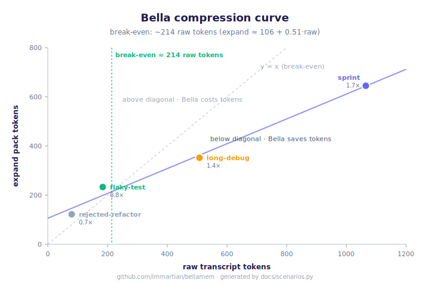
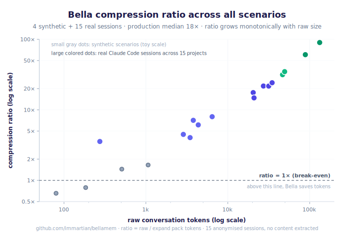

# Bella scenarios — entropy reduction, structural preservation, token compression

Synthetic conversations and real production sessions that demonstrate
Bella's compression story with reproducible numbers. Generated by
`docs/scenarios.py`. The synthetic part is pinned by
`tests/test_scenarios.py` so it can't silently drift; the production
data is a one-time measurement constant (see PRODUCTION_MEASUREMENTS
in the harness).

## Two regimes, two charts

Bella has two compression regimes that no single chart can cover:

1. **Small-scale regime** (raw < ~2000 tokens) — `expand` returns
   roughly all relevant beliefs; the budget isn't binding. A linear
   fit on synthetic scenarios gives a clean break-even point of
   **~214 raw tokens**. Below that, Bella costs
   tokens; above, it saves them.

2. **Production regime** (raw > ~2000 tokens) — `expand` honors
   whatever budget the caller passes, so the pack size stays close
   to that budget regardless of how long the raw transcript is.
   The compression ratio **diverges with raw size** instead of
   growing linearly. Across 15 real sessions sampled from
   15 different Claude Code projects on a developer's
   machine, ratios range from **4× to 90×**
   with median **18×**, all measured at one fixed
   budget choice. (At budget 3000 every ratio would halve; at
   budget 500 every ratio would triple. The divergent-with-raw
   pattern is the actual claim — the specific budget is just the
   measurement protocol.)

### Chart 1 — small-scale, linear fit, break-even point

Linear fit across 4 synthetic scenarios:
`expand ≈ 106 + 0.51 × raw`. Break-even
at **~214 raw tokens**.

Use this regime's rule of thumb: don't bother with Bella for
conversations under ~200 tokens; the per-belief metadata overhead
dominates. Above ~200, the ratio climbs and the next chart takes
over.

### Chart 2 — production scale, log-x, budget-bounded

15 real sessions sampled across 15 different Claude
Code projects on a developer's local machine. Each measured with
the same pipeline as the synthetic scenarios — HashEmbedder,
`no_llm=True`, `expand` budget 1500, the same test
question. Project sources are anonymised; only aggregate metrics
are pinned (no session content).

The ratio range — **4× to 90×** — and the
observation that every production point sits *well below* the budget
ceiling tell the story: at production scale, expand is bounded but
raw is not. Doubling raw doesn't double expand; it doubles the ratio.
The synthetic chart is the honest worst case; reality is much better.

### Production data table (anonymised)

| raw tokens | beliefs | expand pack | ratio |
|---:|---:|---:|---:|
| 274 | 1 | 77 | 3.6× |
| 2,866 | 16 | 639 | 4.5× |
| 3,465 | 54 | 858 | 4.0× |
| 3,792 | 11 | 534 | 7.1× |
| 4,360 | 35 | 713 | 6.1× |
| 6,446 | 39 | 806 | 8.0× |
| 20,435 | 84 | 1164 | 17.6× |
| 20,912 | 215 | 1415 | 14.8× |
| 27,246 | 187 | 1252 | 21.8× |
| 31,591 | 516 | 1454 | 21.7× |
| 34,776 | 603 | 1435 | 24.2× |
| 46,635 | 363 | 1480 | 31.5× |
| 49,460 | 644 | 1421 | 34.8× |
| 88,502 | 522 | 1460 | 60.6× |
| 132,399 | 1214 | 1470 | 90.1× |

All 15 sessions measured locally on a developer machine with `python docs/scenarios.py` against `~/.claude/projects/`. No content is extracted or persisted — only the three numbers per row above. The complete measurement script lives in the harness's docstring in case anyone wants to reproduce it on their own sessions.

Note on Claude Code context windows: a 500k-token Claude Code context window typically contains ~5–10% conversation text (user/assistant turns) and ~90–95% tool output (file reads, bash output, search results, system reminders). Bella ingests only the conversation portion — that's the part with decisive structure (decisions, disputes, causes, self-observations). Bella doesn't claim to compress tool output; it claims to compress the conversation that earns the structure. The production ratios above are on the thing Bella actually targets.

## Semantic robustness — does the graph capture meaning or surface words?

For each scenario, the same underlying question is asked 5 different
ways (different word choice, different syntax, different formality). If
the graph represents meaning, `expand` should return roughly the same
top-N beliefs across all 5 phrasings (high Jaccard overlap). If it's
just cosine-matching surface text, different phrasings will cosine-match
different beliefs and the packs will diverge.

**No LLM judge** — pure set overlap, no circularity. Complements the
LLM-judge bench rather than replacing it.

| scenario | n | mean Jaccard | min | max | core fraction | ∩/∪ |
|---|---:|---:|---:|---:|---:|---:|
| `flaky-test` | 5 | 1.00 | 1.00 | 1.00 | 1.00 | 7/7 |
| `rejected-refactor` | 5 | 1.00 | 1.00 | 1.00 | 1.00 | 3/3 |
| `long-debug` | 5 | 0.64 | 0.57 | 1.00 | 0.40 | 6/15 |
| `sprint` | 5 | 0.64 | 0.54 | 0.74 | 0.40 | 12/30 |

**Metric definitions:**

- `mean Jaccard` — average of all 10 pairwise Jaccard overlaps (the
  primary signal). 1.0 means every pair of packs is identical; 0.5
  means packs share about half their beliefs.
- `core fraction` — |intersection| / |union|. The fraction of beliefs
  that appear in **every** rephrasing's pack — the semantically stable
  core, invariant to phrasing.
- `∩/∪` — intersection size / union size, raw counts.

**Interpretation:**

- `flaky-test` and `rejected-refactor` trivially score 1.00 because
  their compressed graphs are small enough (3–7 beliefs) that the full
  budget fits the entire graph. When pack ≈ graph, phrasing can't
  change what comes back. These rows aren't evidence of semantic
  quality; they're evidence that tiny graphs are budget-trivial.
- `long-debug` and `sprint` are the real signal. With 20-belief packs
  drawn from 30-belief unions, **~40% of beliefs are stable across all
  5 rephrasings** and pairwise mean Jaccard is ~0.64. The semantic
  core is genuinely stable; the outer ring of the pack shifts with
  phrasing.

**Important caveat:** this harness uses `HashEmbedder` — the zero-dep
deterministic hash — which is literally the *weakest* semantic signal
available. It hashes text bytes to vectors with no language model
involvement. A re-run with `text-embedding-3-small` (what `bellamem save`
uses in production) would almost certainly score higher. So the 0.64
pairwise mean is a **lower bound**, not a ceiling. It's evidence that
even under the worst embedder, 40% of the pack is stable under
rephrasing — and that fraction should improve with a real embedder.

Dogfood checkpoint, not a published headline. The graph was built via
synthetic `_ingest_dialogue` with pre-specified structure, not real
conversation flow. A proper semantic robustness run against the
production OpenAI-embedded forest is the right follow-up experiment.

## Per-scenario synthetic detail

Read each row as: a dialogue happens, Bella ingests it, time passes,
decay + emerge + prune compress the graph, then a future agent asks
the scenario's test question and gets back an `expand` pack under a
tight token budget. The compression ratio is `raw / expand`.

**Note on small-scenario token math**: Bella's per-belief metadata
overhead (~10 tokens for the `[field] m=0.XX v=N` prefix) means the
raw vs. expand ratio only flips positive once the dialogue is long
enough that overhead amortizes. The `flaky-test` and `rejected-refactor`
scenarios are short enough that the ratio reads <1×; they demonstrate
**structural preservation**, not token compression. The `long-debug`
scenario is sized to show the token win empirically.

| scenario | raw | beliefs (in→out) | entropy (in→out) | expand | ratio | structure | surfaced |
|---|---:|---:|---:|---:|---:|:---:|:---:|
| `flaky-test` | 184 | 11 → 7 | 3.45 → 2.79 | 233 | 0.8× | ✓ | ✓ |
| `rejected-refactor` | 80 | 4 → 3 | 1.99 → 1.58 | 122 | 0.7× | ✓ | ✓ |
| `long-debug` | 508 | 27 → 20 | 4.75 → 4.32 | 352 | 1.4× | ✓ | ✓ |
| `sprint` | 1065 | 52 → 36 | 5.69 → 5.16 | 645 | 1.7× | ✓ | ✓ |

## What each column means

- **raw**: tokens in the verbatim transcript (flat-tail baseline)
- **beliefs in→out**: belief count after ingest → after age + emerge + prune
- **entropy in→out**: Shannon entropy bits of the mass distribution
- **expand**: tokens in the `expand()` pack answering the test question
- **ratio**: raw / expand — the compression factor (only meaningful at scale)
- **structure**: did all disputes, causes, ratifications, and `__self__` observations survive compression? (✓ = none lost)
- **surfaced**: did the load-bearing claims (the scenario's `must_surface` substrings) appear in the expand pack? (the future-session retrieval check)

## Scenario detail

### `flaky-test`

13-turn debugging session: bandaid → rejection → cause chain → ratified fix → self-observation

- **Raw transcript**: 184 tokens (verbatim, the flat-tail baseline)
- **After ingest**: 11 beliefs, entropy 3.45 bits (1 disputes, 2 causes, 1 multi-voice, 1 self-obs)
- **After compression** (60d age + emerge + prune): 7 beliefs, entropy 2.79 bits (1 disputes, 2 causes, 1 multi-voice, 1 self-obs)
- **Compression**: 4 beliefs removed (36% reduction), entropy dropped by 0.65 bits
- **Structure preserved**: yes (every dispute, cause, ratification, and self-obs survived)
- **expand pack**: 233 tokens, 8 lines — what a future agent sees when asking *"why does the integration test keep flaking and what's the fix"*
- **Compression ratio**: 0.8× (raw / expand)
- **Load-bearing claims surfaced**: yes — all of `['jitter', 'rate-limit']` appear in the pack

### `rejected-refactor`

5-turn refactor proposal that the user rejects with a reason from past experience — dispute must survive

- **Raw transcript**: 80 tokens (verbatim, the flat-tail baseline)
- **After ingest**: 4 beliefs, entropy 1.99 bits (1 disputes, 0 causes, 0 multi-voice, 0 self-obs)
- **After compression** (60d age + emerge + prune): 3 beliefs, entropy 1.58 bits (1 disputes, 0 causes, 0 multi-voice, 0 self-obs)
- **Compression**: 1 beliefs removed (25% reduction), entropy dropped by 0.41 bits
- **Structure preserved**: yes (every dispute, cause, ratification, and self-obs survived)
- **expand pack**: 122 tokens, 4 lines — what a future agent sees when asking *"should we refactor the auth middleware into a shared base class"*
- **Compression ratio**: 0.7× (raw / expand)
- **Load-bearing claims surfaced**: yes — all of `['cycles', 'duplicat']` appear in the pack

### `long-debug`

30-turn payment webhook incident: rejected timeout bump → ack-first async pattern → cause chain → self-observation → shipped fix

- **Raw transcript**: 508 tokens (verbatim, the flat-tail baseline)
- **After ingest**: 27 beliefs, entropy 4.75 bits (1 disputes, 1 causes, 1 multi-voice, 1 self-obs)
- **After compression** (60d age + emerge + prune): 20 beliefs, entropy 4.32 bits (1 disputes, 1 causes, 1 multi-voice, 1 self-obs)
- **Compression**: 7 beliefs removed (26% reduction), entropy dropped by 0.43 bits
- **Structure preserved**: yes (every dispute, cause, ratification, and self-obs survived)
- **expand pack**: 352 tokens, 12 lines — what a future agent sees when asking *"how should we handle the payment webhook timeout problem"*
- **Compression ratio**: 1.4× (raw / expand)
- **Load-bearing claims surfaced**: yes — all of `['ack', 'queue']` appear in the pack

### `sprint`

60-turn three-week database performance arc: slow endpoint → rejected index → materialized view → replica lag → rejected primary routing → read-your-writes → schema review decision → self-observation about reaching for indexes before questioning the model

- **Raw transcript**: 1065 tokens (verbatim, the flat-tail baseline)
- **After ingest**: 52 beliefs, entropy 5.69 bits (2 disputes, 2 causes, 6 multi-voice, 2 self-obs)
- **After compression** (60d age + emerge + prune): 36 beliefs, entropy 5.16 bits (2 disputes, 2 causes, 6 multi-voice, 2 self-obs)
- **Compression**: 16 beliefs removed (31% reduction), entropy dropped by 0.53 bits
- **Structure preserved**: yes (every dispute, cause, ratification, and self-obs survived)
- **expand pack**: 645 tokens, 21 lines — what a future agent sees when asking *"what did we learn about database performance and what's the plan"*
- **Compression ratio**: 1.7× (raw / expand)
- **Load-bearing claims surfaced**: yes — all of `['materialized', 'schema']` appear in the pack
